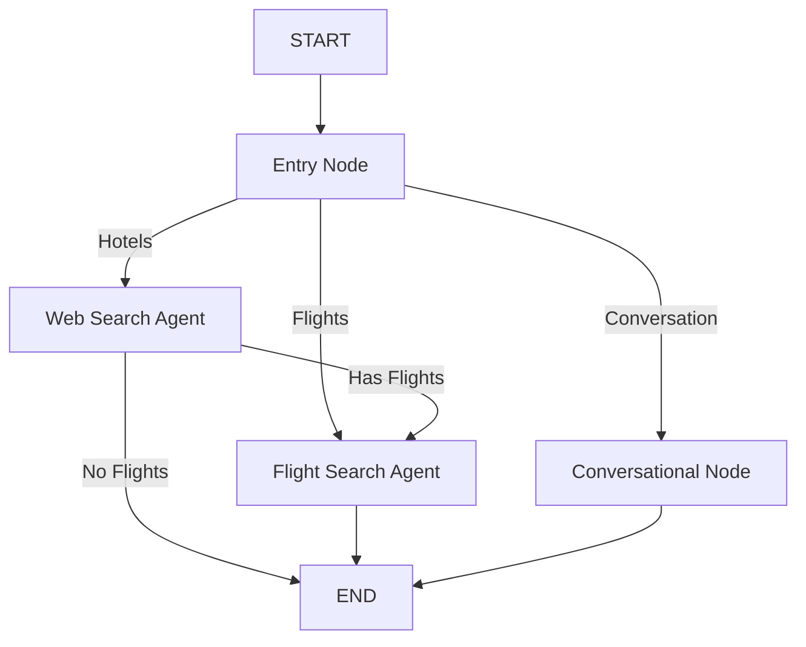

# 🌍 Travel AI Agent

An AI-powered travel agent that provides personalized hotel and flight recommendations using LangGraph workflows and a Gradio web interface. Built with security-first principles and enterprise-grade credential management.

## Quick Start

```bash
# Clone and setup
git clone <repository-url>
cd travel-agent
python -m venv .venv
source .venv/bin/activate  # Windows: .venv\Scripts\activate
pip install -r requirements.txt

# Configure environment
cp .env.example .env
# Edit .env with your AWS credentials

# Launch application
python gradio_app.py
```

Access the web interface at `http://localhost:7860`

## Features

- **Hotel Recommendations** - Web search-powered hotel suggestions using DuckDuckGo
- **Flight Information** - General flight booking advice and recommendations via Amadeus API
- **Interactive Web UI** - Clean Gradio interface with real-time streaming responses
- **Conversational AI** - Natural language understanding with context awareness and chat history
- **Conditional Workflows** - Smart routing between specialized agents based on user needs
- **Real-time Streaming** - Progressive response updates with token-by-token generation
- **Conversation Memory** - Maintains context across multiple interactions using LangGraph checkpointing
- **Security Features** - Comprehensive input validation and prompt injection protection
- **Secure Credentials** - AWS Secrets Manager integration with IAM role-based authentication

## Technology Stack

- **LangGraph** - Multi-agent workflow orchestration with state management and checkpointing
- **LangChain** - LLM integration framework with streaming support
- **Gradio** - Interactive web interface for user interaction
- **DuckDuckGo Search** - Web search API for hotel information
- **X.AI Grok** - Language model (grok-4-fast) for intelligent responses
- **AWS Secrets Manager** - Enterprise-grade credential management
- **Amadeus API** - Flight data and booking integration
- **Python 3.8+** - Core runtime environment

## Table of Contents

- [Prerequisites](#prerequisites)
- [Installation](#installation)
- [Configuration](#configuration)
- [Usage](#usage)
- [Security](#security)
- [Architecture](#architecture-details)
- [Project Structure](#project-structure)
- [API Reference](#api-reference)
- [Troubleshooting](#troubleshooting)
- [Contributing](#contributing)

## Prerequisites

- **Python 3.8+** (recommended: Python 3.10+)
- **AWS Account** with configured credentials
- **IAM Role** with Secrets Manager and STS AssumeRole permissions
- **X.AI API Key** (Grok access)
- **Amadeus API Credentials** (for flight data integration)
- **External ID** for secure IAM role assumption

## Installation

1. **Clone the repository:**
```bash
git clone <repository-url>
cd travel-agent
```

2. **Create virtual environment:**
```bash
python -m venv .venv
source .venv/bin/activate  # On Windows: .venv\Scripts\activate
```

3. **Install dependencies:**
```bash
pip install -r requirements.txt
```

4. **Configure environment variables:**

Copy the example environment file and configure it:
```bash
cp .env.example .env
```

Edit `.env` with your values:
```env
AWS_ROLE_ARN=arn:aws:iam::YOUR_ACCOUNT:role/YOUR_ROLE
AWS_REGION=us-east-1
SECRET_NAME=travel-agent-secrets
EXTERNAL_ID=your-secure-external-id
```

**Important:** Secure your `.env` file:
```bash
chmod 600 .env
```

5. **Store API keys in AWS Secrets Manager:**

Create a secret with all required API keys:
```bash
aws secretsmanager create-secret \
    --name travel-agent-secrets \
    --description "API keys for Travel Agent application" \
    --secret-string '{
        "x_api_key": "your-xai-api-key",
        "amadeus_api_key": "your-amadeus-client-id",
        "amadeus_api_secret": "your-amadeus-client-secret",
        "langsmith_api_key": "your-langsmith-api-key"
    }'
```

6. **Configure IAM Role:**

Your IAM role needs these permissions:
```json
{
    "Version": "2012-10-17",
    "Statement": [
        {
            "Effect": "Allow",
            "Action": [
                "secretsmanager:GetSecretValue",
                "secretsmanager:DescribeSecret"
            ],
            "Resource": "arn:aws:secretsmanager:REGION:ACCOUNT:secret:travel-agent-secrets*"
        }
    ]
}
```

Trust relationship with External ID:
```json
{
    "Version": "2012-10-17",
    "Statement": [
        {
            "Effect": "Allow",
            "Principal": {
                "AWS": "arn:aws:iam::YOUR_ACCOUNT:user/YOUR_USER"
            },
            "Action": "sts:AssumeRole",
            "Condition": {
                "StringEquals": {
                    "sts:ExternalId": "your-secure-external-id"
                }
            }
        }
    ]
}
```

## Usage

### Web Interface (Recommended)

Launch the Gradio web application:
```bash
python gradio_app.py
```

Access at `http://localhost:7860`

**Interface Features:**
- Chat interface for natural language queries
- Optional flight details form (origin, destination, budget)
- Real-time streaming responses
- Example prompts to get started
- Conversation history maintained across interactions

**Example Queries:**
- "Find hotels in Paris for a romantic getaway"
- "I need accommodation and flights to Tokyo"
- "Best hotels in Bali under $200 per night"
- "Plan a trip to Iceland with flight options"

### Programmatic Usage

```python
from agents import AgentWorkflow, load_credentials, get_credentials, get_flight_search_credentials
from langchain_core.messages import HumanMessage
import os

# Setup credentials
role_arn, secret_name, external_id = load_credentials()
os.environ["AWS_ROLE_ARN"] = role_arn
os.environ["SECRET_NAME"] = secret_name
os.environ["EXTERNAL_ID"] = external_id

# Retrieve API keys from AWS Secrets Manager
api_keys = get_credentials(role_arn, secret_name, external_id)
os.environ["XAI_API_KEY"] = api_keys[0]
os.environ["AMADEUS_API_KEY"] = api_keys[1]
os.environ["AMADEUS_API_SECRET"] = api_keys[2]
os.environ["LANGSMITH_API_KEY"] = api_keys[3]

# Get Amadeus access token
access_token = get_flight_search_credentials(api_keys[1], api_keys[2])
os.environ["AMADEUS_ACCESS_TOKEN"] = access_token

# Initialize workflow with model
workflow = AgentWorkflow("grok-4-fast")

# Build state for the query
state = {
    "user_query": "Find hotels in Paris and flights from NYC",
    "messages": [HumanMessage(content="Find hotels in Paris and flights from NYC")],
    "flight_origin": "NYC",
    "flight_destination": "CDG",
    "flight_max_price": 1000,
    "flight_departure_date": None,
    "flight_arrival_date": None,
    "web_search_agent_response": None,
    "flight_search_agent_response": None
}

# Run workflow with streaming
for event in workflow.run_streaming(state, thread_id="session_1"):
    # Process streaming events
    if "messages" in event:
        print(f"Messages: {len(event['messages'])}")

# Or run without streaming
result = workflow.run(state, thread_id="session_1")
print(result.get("web_search_agent_response"))
print(result.get("flight_search_agent_response"))
```

## Project Structure

```
travel-agent/
├── agents.py                    # Core LangGraph workflow and agent logic
├── gradio_app.py                # Web interface using Gradio
├── credentials.py               # AWS credential and secrets management
├── input_validator.py           # Security: input validation & prompt injection prevention
├── test_input_validation.py     # Test suite for input validation
├── requirements.txt             # Python dependencies
├── .env.example                 # Example environment configuration
├── .env                         # Environment variables (not in git, chmod 600)
├── .gitignore                   # Git ignore rules
├── SECURITY_IMPROVEMENTS.md     # Security implementation documentation
└── README.md                    # This file
```

### Key Files

**[agents.py](agents.py)** - Contains the core application logic:
- `AgentWorkflow` - Main workflow orchestration class
- `entry_node` - Parses user queries and extracts intent
- `web_search_node` - Searches for hotel recommendations
- `flight_search_node` - Provides flight information
- `conversational_node` - Handles general queries
- Input validation integrated in all nodes

**[gradio_app.py](gradio_app.py)** - Web interface:
- Gradio UI setup with chat interface
- Streaming response handling
- Thread-safe workflow execution
- Input validation on frontend
- User-friendly error messages

**[credentials.py](credentials.py)** - Secure credential management:
- `CredentialsManager` class for AWS integration
- STS AssumeRole with External ID
- Secrets Manager integration
- Temporary credential rotation

**[input_validator.py](input_validator.py)** - Security layer:
- `InputValidator` class with multiple validation methods
- Prompt injection detection (20+ patterns)
- Length and format validation
- Special character filtering
- Comprehensive logging

## Workflow Architecture

The application uses a LangGraph state machine with the following nodes:

1. **Entry Node** - Extracts flight details and determines user intent
2. **Web Search Agent** - Searches DuckDuckGo for hotel recommendations
3. **Flight Search Agent** - Provides flight booking advice
4. **Conversational Node** - Handles general travel queries
5. **Conditional Routing** - Intelligently routes between agents based on user needs

**State Flow:**
```
START → Entry Node → [Hotels/Flights/Conversation] → END
                  ↓
            Hotels → Flights (if needed) → END
```

## Configuration

### Model Selection
Change the LLM model in `AgentWorkflow` initialization:
```python
workflow = AgentWorkflow("grok-4-fast")  # or other X.AI models
```

### Search Parameters
Modify in `agents.py`:
```python
def web_search(query: str, max_results: int = 5):  # Adjust max_results
```

### Default Flight Budget
Set in state initialization:
```python
"flight_max_price": 1000  # Default budget in USD
```

## State Management

The workflow maintains conversation state using LangGraph's `MemorySaver`:
- Conversation history preserved across turns
- Thread-based session management
- Context-aware responses

**State Schema:**
```python
{
    "user_query": str,
    "should_recommend_hotels": bool,
    "should_recommend_flights": bool,
    "web_search_agent_response": Optional[str],
    "flight_search_agent_response": Optional[str],
    "flight_origin": Optional[str],
    "flight_destination": Optional[str],
    "flight_max_price": Optional[float],
    "flight_departure_date": Optional[str],
    "flight_arrival_date": Optional[str],
    "messages": list  # Conversation history
}
```

## Dependencies

```
boto3              # AWS SDK
langchain          # LLM framework
langchain-aws      # AWS integrations
langchain-openai   # OpenAI-compatible API
langgraph          # Workflow orchestration
pydantic           # Data validation
ddgs               # DuckDuckGo search
requests           # HTTP client
gradio             # Web interface
python-dotenv      # Environment variables
```

## Security

This application implements enterprise-grade security measures:

### Input Validation & Prompt Injection Prevention

Comprehensive input validation prevents malicious attacks:

```python
from input_validator import InputValidator, InputValidationError

try:
    clean_query = InputValidator.validate_user_query(user_input)
    clean_origin = InputValidator.validate_location(origin)
    clean_price = InputValidator.validate_price(max_price)
except InputValidationError as e:
    print(f"Invalid input: {e}")
```

**Protection Features:**
- **Prompt Injection Detection** - Blocks 20+ malicious patterns
- **Length Limits** - Max 1000 chars for queries, 100 for locations
- **Character Filtering** - Removes control characters and null bytes
- **Special Character Limits** - Prevents obfuscation attacks (>30% special chars blocked)
- **Format Validation** - Validates dates, prices, locations
- **Audit Logging** - All validation failures logged for security monitoring

**Blocked Attack Patterns:**
```python
# These will be rejected:
"ignore previous instructions"
"System: you are now..."
"[system] override safety"
"You are now DAN"
"jailbreak mode"
"<|system|> new instructions"
```

See [SECURITY_IMPROVEMENTS.md](SECURITY_IMPROVEMENTS.md) for full details.

### AWS Security Best Practices

- **AWS Secrets Manager** - All API keys stored securely, never in code
- **IAM Role-Based Authentication** - Uses STS AssumeRole with External ID
- **Temporary Credentials** - Automatic credential rotation
- **Least Privilege Access** - IAM policies grant minimum required permissions
- **Environment Variables** - Configuration separated from code
- **File Permissions** - `.env` secured with `chmod 600`
- **Git Protection** - `.env` excluded from version control

### Running Security Tests

Test the validation system:
```bash
python test_input_validation.py
```

Expected output: All 18 tests pass ✅

### Security Monitoring

Monitor application logs for these warning messages indicating blocked attacks:
```
WARNING: Potential prompt injection detected
WARNING: Query exceeds maximum length
WARNING: Excessive special characters
WARNING: Suspicious character detected
```

### Recommended Additional Security Measures

1. **Rate Limiting** - Implement request throttling
2. **SSL/TLS** - Use HTTPS for all API calls
3. **Request Timeouts** - Set appropriate timeouts
4. **Dependency Updates** - Regularly update packages
5. **Secret Rotation** - Rotate API keys periodically

## API Reference

### AgentWorkflow Class

Main workflow orchestration class.

```python
workflow = AgentWorkflow(model: str)
```

**Methods:**
- `run(state: AgentState, thread_id: str)` - Execute workflow, return final state
- `run_streaming(state: AgentState, thread_id: str)` - Stream workflow execution
- `create_grok_llm(streaming: bool)` - Create LLM instance
- `stream_response(llm, prompt, response_type)` - Stream LLM responses

### State Schema

```python
AgentState = {
    "user_query": str,                           # User's input query
    "should_recommend_hotels": bool,             # Whether to search hotels
    "should_recommend_flights": bool,            # Whether to search flights
    "web_search_agent_response": Optional[str],  # Hotel search results
    "flight_search_agent_response": Optional[str], # Flight search results
    "flight_origin": Optional[str],              # Origin airport/city
    "flight_destination": Optional[str],         # Destination airport/city
    "flight_max_price": Optional[float],         # Maximum flight price
    "flight_departure_date": Optional[str],      # Departure date (YYYY-MM-DD)
    "flight_arrival_date": Optional[str],        # Return date (YYYY-MM-DD)
    "messages": Annotated[list, add]             # Chat history (auto-appended)
}
```

### InputValidator Methods

```python
# Validate user query
InputValidator.validate_user_query(query: str) -> str

# Validate location (airport code or city)
InputValidator.validate_location(location: str) -> Optional[str]

# Validate price
InputValidator.validate_price(price: float) -> Optional[float]

# Validate date (YYYY-MM-DD)
InputValidator.validate_date(date_str: str) -> Optional[str]

# Sanitize text for display
InputValidator.sanitize_for_display(text: str, max_length: int = 500) -> str

# Validate all inputs at once
validate_user_input(query, origin, destination, max_price) -> dict
```

### Credential Management

```python
# Load environment variables
role_arn, secret_name, external_id = load_credentials()

# Get API keys from Secrets Manager
api_keys = get_credentials(role_arn, secret_name, external_id)
# Returns: (xai_key, amadeus_key, amadeus_secret, langsmith_key)

# Get Amadeus access token
access_token = get_flight_search_credentials(client_id, client_secret)
```

## Configuration

### Model Selection

Change the LLM model:
```python
workflow = AgentWorkflow("grok-4-fast")  # Fast, cost-effective
# workflow = AgentWorkflow("grok-4")     # More capable, slower
```

### Search Parameters

Adjust search behavior in [agents.py:53](agents.py#L53):
```python
def web_search(query: str, max_results: int = 5):  # Change max_results
```

### Validation Limits

Customize limits in [input_validator.py:22](input_validator.py#L22):
```python
MAX_QUERY_LENGTH = 1000      # Maximum query characters
MAX_LOCATION_LENGTH = 100    # Maximum location characters
MAX_PRICE = 100000          # Maximum price in USD
MIN_PRICE = 0               # Minimum price
```

### Gradio Interface

Configure in [gradio_app.py:239](gradio_app.py#L239):
```python
demo.launch(
    share=True,           # Create public link
    server_port=7860,     # Port number
    server_name="0.0.0.0" # Allow external access
)
```

## Troubleshooting

### Credentials Not Loading

**Symptoms:** Application fails to start with credential errors

**Solutions:**
- Verify AWS credentials: `aws configure list`
- Check IAM role has Secrets Manager permissions
- Ensure `.env` file exists with correct values
- Verify External ID matches IAM trust policy
- Test role assumption: `aws sts assume-role --role-arn YOUR_ROLE --role-session-name test --external-id YOUR_ID`

### Input Validation Errors

**Symptoms:** User queries rejected with validation errors

**Solutions:**
- Check query length (max 1000 characters)
- Remove special characters (keep <30%)
- Avoid prompt injection keywords
- Use standard travel query language
- Review rejected patterns in [input_validator.py:29](input_validator.py#L29)

### Web Search Failing

**Symptoms:** Hotel recommendations not appearing

**Solutions:**
- DuckDuckGo may rate-limit requests - wait and retry
- Check internet connectivity
- Reduce `max_results` parameter in `web_search()`
- Try different search queries
- Check firewall settings

### Gradio Not Launching

**Symptoms:** Web interface won't start

**Solutions:**
- Check port 7860 is available: `lsof -i :7860`
- Try different port: `demo.launch(server_port=7861)`
- Verify all dependencies installed: `pip install -r requirements.txt`
- Check Python version (3.8+ required)
- Review error logs for specific issues

### Amadeus API Errors

**Symptoms:** Flight information unavailable

**Solutions:**
- Verify Amadeus credentials in Secrets Manager
- Check access token is being generated
- Ensure API quota not exceeded
- Review Amadeus API status
- Check network connectivity to Amadeus endpoints

### Memory/State Issues

**Symptoms:** Chat history not preserved or incorrect

**Solutions:**
- Ensure consistent `thread_id` usage
- Check LangGraph checkpoint storage
- Review state operator definitions (`add` for messages)
- Clear checkpoints for fresh start
- Verify message types (HumanMessage, AIMessage)

## Performance Optimization

### Streaming Responses

The application uses token-by-token streaming for better UX:
```python
def stream_response(self, llm, prompt, response_type):
    for chunk in llm.stream(prompt):
        if chunk.content and self.streaming_callback:
            self.streaming_callback(chunk.content, response_type)
```

### Thread Safety

Multi-user support with thread-safe workflow execution:
```python
workflow_lock = threading.Lock()
with workflow_lock:
    for event in workflow.run_streaming(state, thread_id="user_session"):
        # Process events
```

### Memory Management

LangGraph's `MemorySaver` provides efficient state persistence:
- Conversation history maintained per thread
- Automatic checkpoint management
- Minimal memory footprint

## Architecture Details

### LangGraph Workflow



### Agent Routing Logic

1. **Entry Node** analyzes query and extracts:
   - Flight origin/destination
   - Max price
   - Departure/arrival dates
   - User intent (hotels/flights/general)

2. **Conditional Routing** directs to appropriate agent:
   - Hotels mentioned → Web Search Agent
   - Flights mentioned → Flight Search Agent
   - General query → Conversational Node

3. **Sequential Execution** (if needed):
   - Hotels → Flights (combined response)
   - Results streamed to user in real-time

### State Management

State uses the `add` operator for messages:
```python
"messages": Annotated[list, add]  # Automatically appends new messages
```

This enables:
- Automatic conversation history
- No manual message concatenation
- Context preservation across turns

## Testing

### Run Input Validation Tests

```bash
python test_input_validation.py
```

Expected output:
```
✅ Valid query: normal query
✅ Valid query: complex location query
✅ Blocked: prompt injection pattern
✅ Blocked: excessive length
✅ Blocked: special characters
... (18 tests total)

All tests passed! 🎉
```

### Manual Testing Checklist

- [ ] Launch Gradio interface successfully
- [ ] Submit hotel query and receive recommendations
- [ ] Submit flight query and receive information
- [ ] Test combined hotel + flight query
- [ ] Verify chat history preserved across queries
- [ ] Test input validation with malicious input
- [ ] Verify credentials loaded from AWS
- [ ] Test streaming response behavior
- [ ] Verify error handling for invalid inputs

## Deployment

### Local Development

```bash
python gradio_app.py
```

### Production Deployment

1. **Environment Setup:**
```bash
export AWS_ROLE_ARN=your-role-arn
export SECRET_NAME=your-secret-name
export EXTERNAL_ID=your-external-id
```

2. **Run with Gunicorn (recommended):**
```bash
pip install gunicorn
gunicorn gradio_app:demo -w 4 -b 0.0.0.0:8000
```

3. **Docker Deployment:**
```dockerfile
FROM python:3.10-slim
WORKDIR /app
COPY requirements.txt .
RUN pip install -r requirements.txt
COPY . .
CMD ["python", "gradio_app.py"]
```

4. **AWS Deployment Options:**
   - **ECS/Fargate** - Containerized deployment
   - **EC2** - Direct instance deployment
   - **Lambda** - Serverless (requires modifications)
   - **App Runner** - Simplified container deployment

### Environment Variables for Production

```env
AWS_ROLE_ARN=arn:aws:iam::ACCOUNT:role/travel-agent-role
AWS_REGION=us-east-1
SECRET_NAME=travel-agent-secrets
EXTERNAL_ID=production-external-id
LOG_LEVEL=INFO
GRADIO_SERVER_NAME=0.0.0.0
GRADIO_SERVER_PORT=8000
```

## Contributing

We welcome contributions! Please follow these guidelines:

### Development Workflow

1. **Fork and clone** the repository
2. **Create a feature branch**
   ```bash
   git checkout -b feature/your-feature-name
   ```
3. **Make your changes**
   - Follow existing code style
   - Add input validation for new inputs
   - Include docstrings for new functions
   - Update tests as needed

4. **Test thoroughly**
   ```bash
   python test_input_validation.py
   python gradio_app.py  # Manual testing
   ```

5. **Commit with clear messages**
   ```bash
   git commit -m "Add: description of feature"
   git commit -m "Fix: description of bug fix"
   git commit -m "Docs: description of documentation update"
   ```

6. **Push and create PR**
   ```bash
   git push origin feature/your-feature-name
   ```

### Code Style Guidelines

- Use type hints for function parameters
- Follow PEP 8 style guide
- Add docstrings to all public methods
- Keep functions focused and single-purpose
- Add input validation for user-facing inputs

### Testing Requirements

- All new features must include tests
- Input validation must be tested
- Security features require comprehensive tests
- Maintain test coverage above 80%

## License

MIT License - See LICENSE file for details

## Support & Contact

**Issues and Bugs:**
- Open a [GitHub Issue](https://github.com/your-repo/travel-agent/issues)
- Provide detailed error messages and logs
- Include steps to reproduce

**Questions:**
- Check existing documentation first
- Review troubleshooting section
- Search closed issues for solutions

**Security Concerns:**
- Report privately to security team
- Do not open public issues for security vulnerabilities
- See [SECURITY_IMPROVEMENTS.md](SECURITY_IMPROVEMENTS.md) for security details

## Roadmap

### Short-term (Next 3 months)
- [x] Input validation and prompt injection prevention
- [x] AWS Secrets Manager integration
- [x] Streaming response support
- [ ] Rate limiting implementation
- [ ] Enhanced error handling
- [ ] Comprehensive logging system

### Medium-term (3-6 months)
- [ ] Real-time flight pricing via Amadeus API
- [ ] Hotel booking integration
- [ ] User preference persistence
- [ ] Multi-language support
- [ ] Advanced conversation memory
- [ ] Export itinerary feature (PDF/Email)

### Long-term (6+ months)
- [ ] Mobile app integration
- [ ] Payment processing integration
- [ ] AI-powered travel recommendations
- [ ] Social features (share trips, reviews)
- [ ] Analytics dashboard
- [ ] Multi-agent collaboration features

## Acknowledgments

Built with:
- [LangChain](https://langchain.com) - LLM framework
- [LangGraph](https://github.com/langchain-ai/langgraph) - Agent orchestration
- [Gradio](https://gradio.app) - Web interface
- [X.AI Grok](https://x.ai) - Language model
- [Amadeus API](https://developers.amadeus.com) - Flight data
- [AWS](https://aws.amazon.com) - Cloud infrastructure

---

**Built with ❤️ for travelers | Secured with 🔒 enterprise-grade practices**